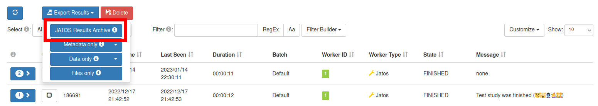

# Novel Objects Experiment

This repository contains code for the web-based human experiments for the paper [Learning to Learn: How to Continuously Teach Humans and Machines](https://arxiv.org/abs/2211.15470).

### Hosting the experiment
To run the experiment locally, make sure [node.js is installed](https://nodejs.org/en/download) and run:

```sh
$ npm install
$ npm run dev
```

and visit http://localhost:5173.

To build a production version of the experiment, run:
```sh
$ npm run build
```

after which the bundled experiment will be written to `dist/` which can be uploaded online.

### Collecting Data

We host the experiment on a [JATOS](https://www.jatos.org/) 
server to collect the experiments.
Instructions to install and get started with the server can be found [here](https://www.jatos.org/Installation.html).

To setup the experiment in JATOS, we provide jzip files for all six curriculums in `build/` which can be imported into JATOS as instructed [here](https://www.jatos.org/Get-started.html).

### Computing Results
The raw results for the experiment can be viewed in the JATOS server. To compute the accuracy and forgetfulness, we provide the `parse-results.js` file which writes the results to a JSON file.

In order get the accuracy and forgetfulness, export the raw result files for the desired participants as instructed [here](https://www.jatos.org/Manage-Results). Make sure to export export a JATOS Results Archive (JRZIP) file.



In an empty directory, unzip the jrzip file and run the `parse-results.js` script from there.

For instance, assuming you are at the directory of this repository in the terminal.

```sh
$ mkdir results && cd results
$ cp results.jrzip .
$ unzip results.jrzip
$ node ../parse-results.js
```
